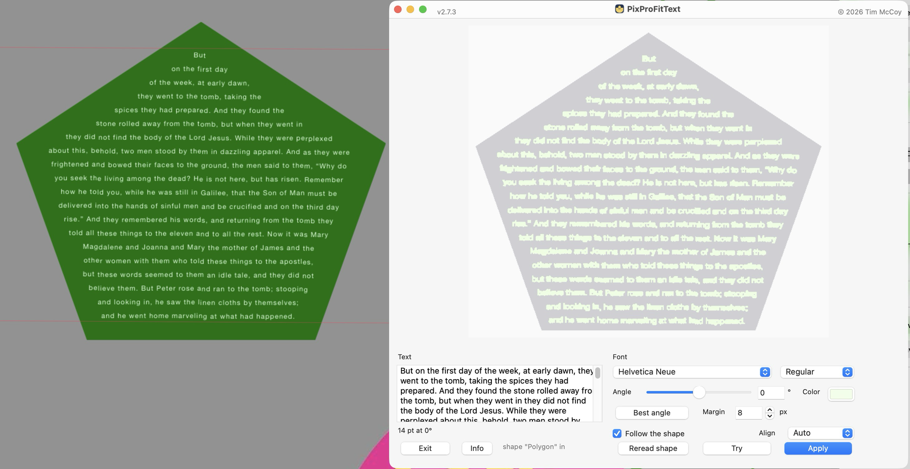

# PixProFitText 3.5.3

Fits a block of text inside an irregular Pixelmator Pro shape, at the largest
size that stays inside the outline.

Select a shape layer, type or paste the text, press **Try** to see it, press
**Apply** to put it on the canvas as an ordinary editable text layer.

### [⬇︎ Download the latest release](https://github.com/spurious-cox/pixprofittext/releases/latest)

Notarized and stapled by Apple — open the DMG and drag PixProFitText to
Applications, or install it with Homebrew:

```
brew install --cask spurious-cox/tap/pixprofittext
```
Requires Pixelmator Pro.



## What it does

* Fits to the **outer** boundary of the selected shape layer. Holes inside are
  fine to cover.
* **Follows the shape**: each line is as long as the row it sits on allows.
* Picks the **justification from the shape**, with an override.
* Rotates to any **angle**, and can find the angle that fits the largest text.
* Each **Apply** makes its own layer, named for the shape.

## Where the shape comes from

PixProFitText fits text into a shape layer you already have. Three ways to get
one, all of which produce the same thing:

* **The Shapes browser** — Pixelmator ships hundreds. Drag one onto the canvas.
* **Draw your own** — the Pen or Freeform Pen tool for an outline of your own,
  or the rectangle, ellipse, polygon and star tools for a primitive.
* **Convert something** — Format ▸ Convert to Shape turns a text layer into
  shapes, which is how you fit text inside a letterform.

Select the shape layer, then press **Reread shape**.

## Using it

| Control | What it does |
| --- | --- |
| **Reread shape** | re-reads the selected shape layer out of Pixelmator |
| **Try** | works out the fit and previews it — nothing reaches the canvas |
| **Apply** | places it as a new text layer, then checks it really fits |
| **Best angle** | tries every angle in 5° steps and keeps the largest fit |
| **Follow the shape** | on: re-flow per row. off: your own line breaks, scaled as one block |
| **Align** | Auto reads it off the shape; Left / Center / Right force it |
| **Margin** | pixels of clearance kept between the ink and the outline |
| **Info** | what the app promises, and what it leaves to you |
| **Updates…** | asks GitHub whether a newer release has been published |

Nothing is recomputed while you type — **Try** is what does the work.

## Updates

**Updates…** asks GitHub for the newest published release and compares it
with this build. It only ever reports: nothing is downloaded, and nothing
replaces itself. If there is a newer one it offers to open the releases
page, or you can take it through Homebrew:

    brew upgrade --cask pixprofittext

## Finishing by hand

The result is an ordinary text layer, so Pixelmator's **Text panel** still
applies. Reach for **Line Height** first: Pixelmator exposes no leading,
spacing, kerning or tracking property to scripting at all, so opening the
spacing up by hand is the intended finish rather than a workaround.

## Known limits

* **Notches are hard.** A line is sized for its row, so anything that moves the
  lines vertically afterwards — including your own Line Height change — can
  push a long line into a gap.
* **The width ratio is size-dependent.** Pixelmator sets text wider than AppKit,
  and by more at small sizes. The calibration stores one number and the verify
  loop absorbs the rest.
* **Line spacing is not scriptable.**

## How it works

1. **Export the shape** — the selected layer is soloed, exported, and its
   visibility restored by layer id.
2. **Flow the text** — each line gets the widest run of the shape clear for the
   whole height of that line.
3. **Place it** — the text mask and the shape are cross-correlated with an FFT;
   the valid offset nearest the centroid wins.
4. **Calibrate** — Pixelmator's line width and line pitch are measured once per
   font, in a scratch document, never in yours.
5. **Verify** — the placed ink is compared with the shape; too big and it
   shrinks, out of place and it nudges.

## Building

    ./build.sh              build and sign into dist/
    ./build.sh --install    also install to /Applications
    ./release.sh            notarize, staple, and wrap it in a DMG

`build.sh` signs but does not notarize. `release.sh` does both the app and the
DMG and staples each, using the `PixProNotary` keychain profile.

## Files

    pixprofittext.py     the app: window, controls, preview, settings
    fittext_engine.py    the geometry — masks, flow, placement. No Pixelmator.
    pixbridge.py         every line of AppleScript that talks to Pixelmator
    build.sh             build, sign, install
    release.sh           notarize, staple, and build the DMG
    make_icon.py         builds the icns from icon/
    setup.py             py2app configuration

`fittext_engine.py` has no Pixelmator dependency and can be exercised on its
own — give it a boolean mask and a string.

## Requirements

macOS 26, Pixelmator Pro, Python 3.14 with PyObjC, numpy and Pillow in `venv/`.
Two Pixelmator builds may be installed at once; the app binds by **bundle id**
and prefers whichever has a document open.

## Problems or suggestions

Open an issue: https://github.com/spurious-cox/pixprofittext/issues

## License

MIT. See [LICENSE](LICENSE).
